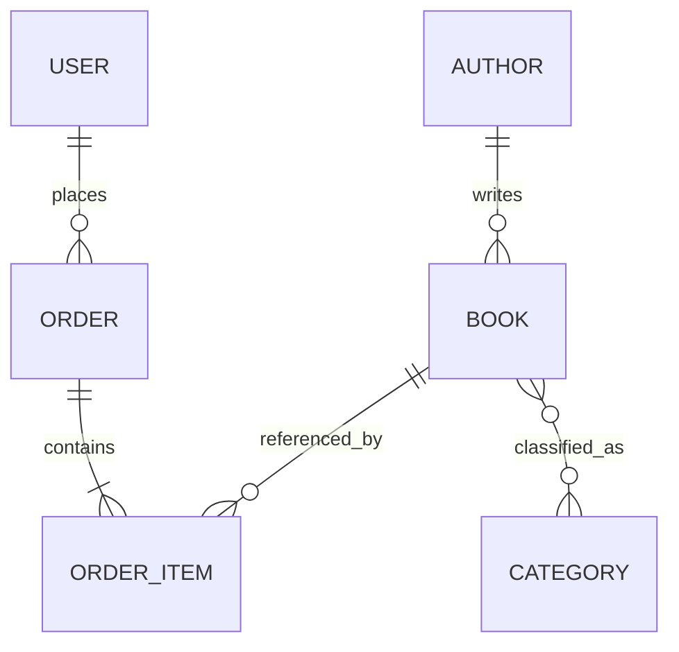

# bookstore-api

API REST construida con Spring Boot para la gestion de una libreria en linea. El proyecto mantiene arquitectura por capas, seguridad con JWT, relaciones JPA y contratos HTTP normalizados.

## Stack
- Java 17
- Spring Boot 3
- Spring Web
- Spring Data JPA
- Spring Security
- JWT
- H2 para desarrollo
- PostgreSQL para otros entornos
- Swagger / OpenAPI
- Maven

## Paquetes obligatorios
```text
com.taller.bookstore
|- config
|- controller
|- dto
|  |- request
|  \- response
|- entity
|- exception
|  |- custom
|  \- handler
|- mapper
|- repository
|- security
|- service
\- service.impl
```

## Datos semilla
La aplicacion crea dos usuarios y un catalogo basico al iniciar.

- ADMIN
  - email: `admin@lecturaypunto.com`
  - password: `Catalogo123*`
- USER
  - email: `cliente@lecturaypunto.com`
  - password: `Cliente123*`

Tambien se cargan autores, categorias y libros de ejemplo para probar filtros, pedidos y relaciones.

## Ejecucion local
1. Abrir la carpeta `bookstore-api` como proyecto Maven.
2. Esperar la resolucion de dependencias.
3. Ejecutar `BookstoreApiApplication`.
4. Probar la API en:
   - `http://localhost:8080/api/v1`
   - `http://localhost:8080/api/v1/swagger-ui/index.html`
   - `http://localhost:8080/api/v1/h2-console`

## Endpoints base
- `POST /auth/register`
- `POST /auth/login`
- `GET /books`
- `GET /authors/{id}/books`
- `GET /categories/{id}/books`
- `POST /orders`
- `GET /orders/my`
- `GET /orders`

## Contrato de respuesta exitosa
```json
{
  "status": "success",
  "code": 200,
  "message": "Operacion completada",
  "data": {},
  "timestamp": "2026-04-21T12:00:00Z"
}
```

## Contrato de error
```json
{
  "status": "error",
  "code": 404,
  "message": "El recurso solicitado no fue encontrado",
  "errors": ["book with id 99 not found"],
  "timestamp": "2026-04-21T12:00:00Z",
  "path": "/api/v1/books/99"
}
```

## Variable de entorno
```bash
JWT_SECRET=tu_clave_base64
```

## Postman
La coleccion esta en `postman/bookstore-api.postman_collection.json`.

## Modelo relacional

