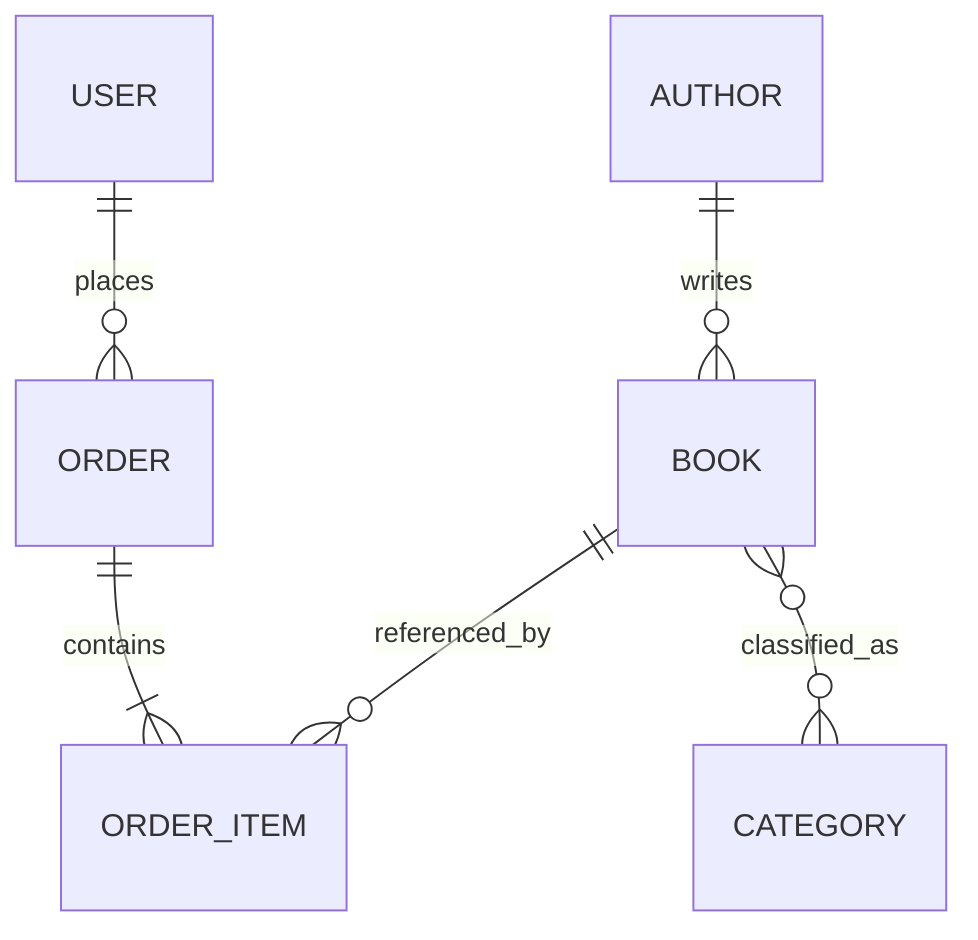

# bookstore-api

API REST con Spring Boot para la gestión de una librería en línea.

## Tecnologías
- Java 17+
- Spring Boot 3
- Spring Web
- Spring Data JPA
- Spring Security
- JWT
- H2 Database
- PostgreSQL driver
- Swagger / OpenAPI
- Maven

## Estructura de paquetes
```text
com.taller.bookstore
├── config
├── controller
├── dto
│   ├── request
│   └── response
├── entity
├── exception
│   ├── custom
│   └── handler
├── mapper
├── repository
├── security
├── service
└── service.impl
```

## Credenciales demo
Se crean automáticamente al iniciar la aplicación:

- **ADMIN**
  - email: `admin@bookstore.com`
  - password: `Admin123*`

- **USER**
  - email: `user@bookstore.com`
  - password: `User1234*`

## Cómo ejecutar en IntelliJ IDEA
1. Abre la carpeta `bookstore-api` como proyecto Maven.
2. Espera a que IntelliJ descargue dependencias.
3. Ejecuta la clase `BookstoreApiApplication`.
4. La API quedará disponible en:
   - Base URL: `http://localhost:8080/api/v1`
   - Swagger: `http://localhost:8080/api/v1/swagger-ui/index.html`
   - H2 Console: `http://localhost:8080/api/v1/h2-console`

## Endpoints principales
### Auth
- `POST /auth/register`
- `POST /auth/login`

### Books
- `GET /books`
- `GET /books/{id}`
- `POST /books` (ADMIN)
- `PUT /books/{id}` (ADMIN)
- `DELETE /books/{id}` (ADMIN)

### Authors
- `GET /authors`
- `GET /authors/{id}`
- `GET /authors/{id}/books`
- `POST /authors` (ADMIN)
- `PUT /authors/{id}` (ADMIN)
- `DELETE /authors/{id}` (ADMIN)

### Categories
- `GET /categories`
- `GET /categories/{id}`
- `GET /categories/{id}/books`
- `POST /categories` (ADMIN)
- `PUT /categories/{id}` (ADMIN)
- `DELETE /categories/{id}` (ADMIN)

### Orders
- `POST /orders`
- `GET /orders/my`
- `GET /orders` (ADMIN)
- `PATCH /orders/{id}/confirm` (ADMIN)
- `PATCH /orders/{id}/cancel`

## Respuesta exitosa
```json
{
  "status": "success",
  "code": 200,
  "message": "Operación completada",
  "data": {},
  "timestamp": "2026-04-20T12:00:00Z"
}
```

## Respuesta de error
```json
{
  "status": "error",
  "code": 404,
  "message": "El recurso solicitado no fue encontrado",
  "errors": ["book with id 99 not found"],
  "timestamp": "2026-04-20T12:00:00Z",
  "path": "/api/v1/books/99"
}
```

## Variables de entorno opcionales
Puedes definir:

```bash
JWT_SECRET=tu_clave_base64
```

Si no la defines, el proyecto usa una clave demo incluida en `application.yml`.

## Postman
En la carpeta `postman/` se incluye la colección:

- `bookstore-api.postman_collection.json`

## Diagrama ER (Mermaid)

